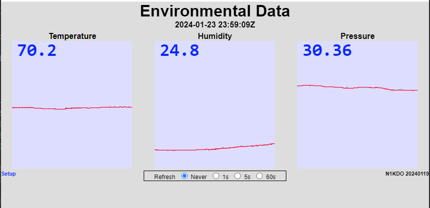
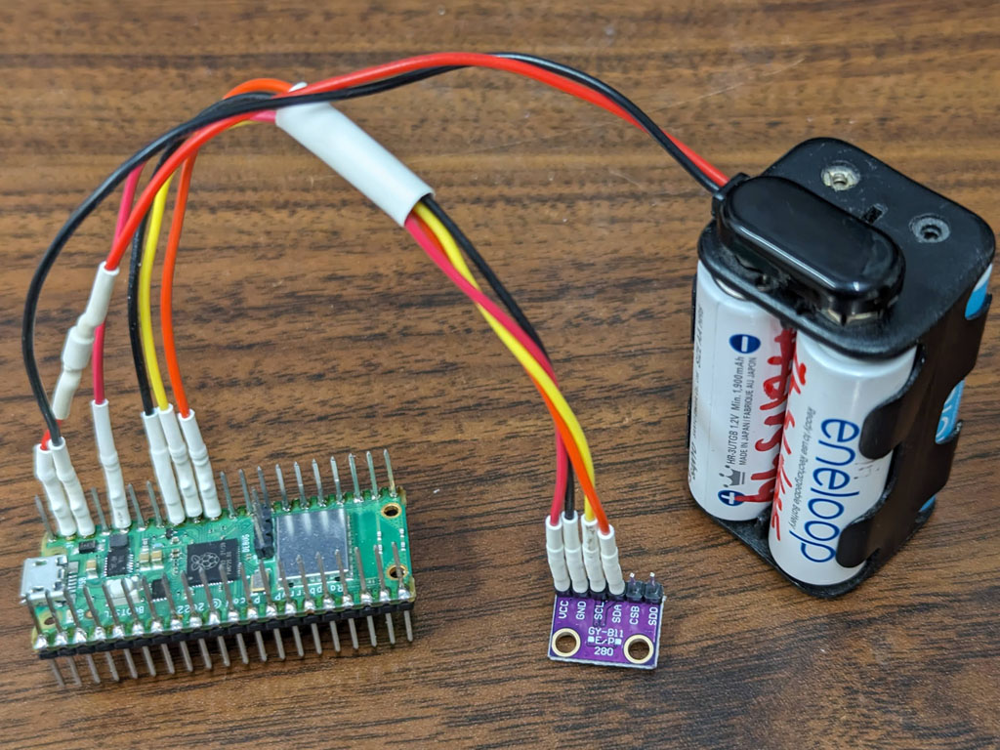

# Raspberry Pi Pico W Temperature and Humidity

This runs on Raspberry Pi Pico W and uses a Bosch BME sensor to collect
Temperature, Humidity, and Atmospheric Pressure.

It provides the temperature and humidity values on a locally-hosted web page, and through 
the `/api/status` API which returns a JSON document containing timestamp, temperature,
and humidity values.

## hardware

### BME280 Temperature, Humidity, Pressure

This version uses a Bosch BME280 sensor on a breakout board from Amazon.  The required pull-up resistors
are present on the board, so this is just four wires.

| Pico-W Pin   | Pico-W pin # | BME280 |
|--------------|--------------|--------|
| SDA          | 31           | SDA    |
| SCL          | 32           | SCL    |
| GND          | 33           | GND    |
| 3V3(OUT)     | 36           | VCC    |

### Other important wiring

| device                             | purpose                   | pin # | pin label |
|------------------------------------|---------------------------|-------|-----------|
| LED to ground through 330 ohms     | morse code status message | 4     | GP2       |
| Pushbutton to ground               | select AP mode            | 5     | GP3       |
|                                    |                           |       |           |
| Battery + (through Schottky diode) | backup power              | 39    | VSYS      | 
| Battery - (4 NiMH 5 volts)         | backup power              | 38    | GND       |

The LED is used to provide the IP address of the device, which is sent by Morse code. When the device
is configured as an access point, the message will be "AP 192 168 4 1" to indicate that access point
mode is operational.

The Pushbutton is used to select Access Point mode.  Hold the button down for at least 1/2 second and the
device will toggle access point mode and restart.

The backup battery can be used to keep the device powered up during AC power failure.  Use a Schottky diode in
the battery wire to prevent the Pico-W from trying to charge the battery pack, or worse.  Also, **WARNING** do not
use any battery pack that can produce more than 5 volts, which means **do not use 4 conventional AA cells in
series**.  I use four NiMH cells in series.  

### setup

1. press the AP mode button and the device will restart in access point mode. 
2. connect to the 'bmp280' WiFi network using password 'temperature'.  
3. your phone or tablet may resist staying connected to this network as the internet is unreachable through it. 
   this needs to be dealt with on that device.
4. navigate to http://192.168.4.1 which should show the temperature page.
5. click the 'setup' link in the lower left.
6. set your SSID and password on this page.
7. press 'apply' and then 'restart'.
8. the device should connect to your network.

### software

This uses some of the same software I wrote for my
[Ham-IV Rotator Controller-Controller](https://github.com/n1kdo/rotator-controller-controller).

n1kdo 20240123

