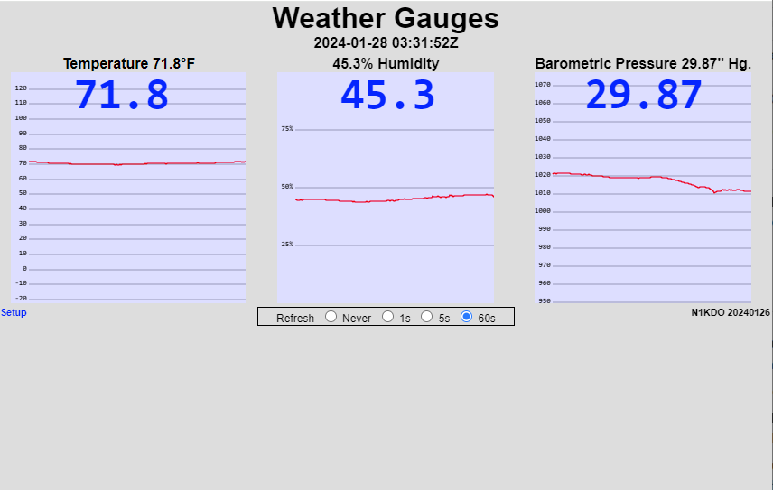

# Raspberry Pi Pico W Weather Gauges

This runs on $6 Raspberry Pi Pico W and uses a $7 Bosch BME280 sensor to collect
Temperature, Humidity, and Atmospheric Pressure.

It provides the current temperature, humidity, and barometric pressure in convenient
Fahrenheit and Imperial Inches of Mercury. The current values can be fetched via web 
API, raw socket, and on local web page.  The web page provides graphs that show daily
trends of the data.

## hardware

### BME280 Temperature, Humidity, Pressure

This version uses a Bosch BME280 sensor on a breakout board from Amazon.  The required pull-up resistors
are present on the board, so this is just four wires.

| Pico-W Pin   | Pico-W pin # | BME280 |
|--------------|--------------|--------|
| SDA          | 31           | SDA    |
| SCL          | 32           | SCL    |
| GND          | 33           | GND    |
| 3V3(OUT)     | 36           | VCC    |

### Other important wiring

| device                             | purpose                   | pin # | pin label |
|------------------------------------|---------------------------|-------|-----------|
| Pushbutton to ground               | select AP mode            | 5     | GP3       |
|                                    |                           |       |           |
| Battery + (through Schottky diode) | backup power              | 39    | VSYS      | 
| Battery - (4 NiMH 5 volts)         | backup power              | 38    | GND       |

The onboard LED is used to provide the IP address of the device, which is sent by Morse code. When the device
is configured as an access point, the message will be "AP 192 168 4 1" to indicate that access point
mode is operational.

The Pushbutton is used to select Access Point mode.  Hold the button down for at least 1/2 second and the
device will toggle access point mode and restart.

The backup battery can be used to keep the device powered up during AC power failure.
Use a 1N5819 Schottky diode in the positive battery wire to prevent the Pico-W from
trying to charge the battery pack, *or worse*.  Put the cathode side of the diode
(the end with the band) pointed at the Pico-W.

**WARNING:**

Do not use any battery pack that can produce more than 5.5 volts, 
which means **do not use 4 conventional AA cells in series**. 

I use four NiMH cells in series.

The [Pico-W data sheet](https://datasheets.raspberrypi.com/picow/pico-w-datasheet.pdf) 
specifies VSYS Max as 5.5 volts, and 4 dry cells is more than that. *Do not let the magic smoke out.*

### setup

See [Installation and Setup](Installation-and-Setup.md)

### software

This uses some of the same software I wrote for my
[Ham-IV Rotator Controller-Controller](https://github.com/n1kdo/rotator-controller-controller).

n1kdo 20240128

